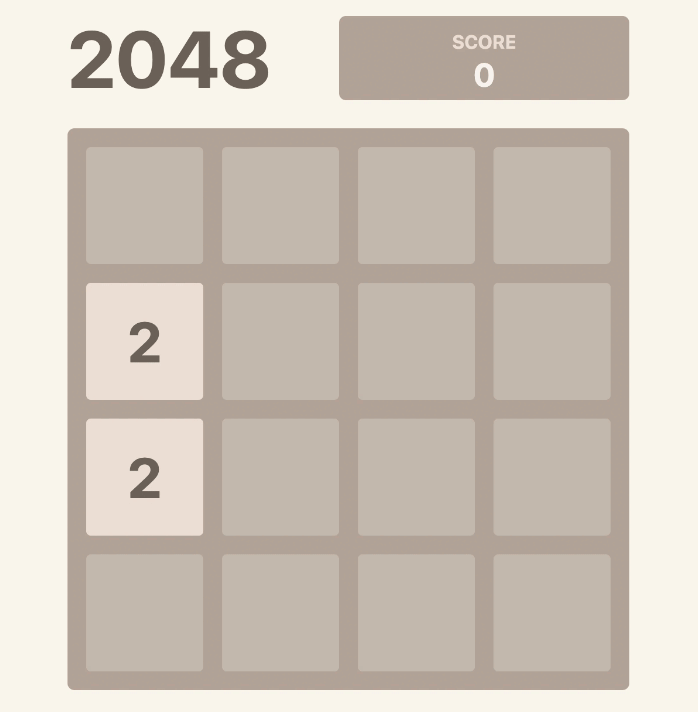

# 2048-in-react

Ceci est un clone entièrement fonctionnel du célèbre jeu 2048, construit avec React, TypeScript et Next.js

## [Play 2048 💥](https://2048-game-type.netlify.app/)

## Features

- Clone 2048 entièrement fonctionnel
- Animations
- Prise en charge des **événements clavier** et **tactiles**

## Development

- clone
- `npm install`
- `npm run dev`

**Start coding!** 🎉
